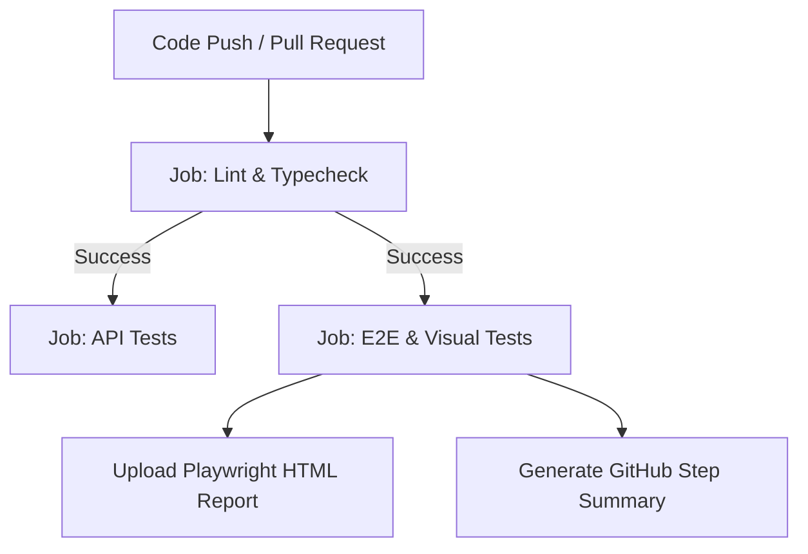

# 🛠️ Practice Software Testing — Playwright Enterprise Automation Suite

[](https://playwright.dev/)
[](https://www.typescriptlang.org/)
[](https://nodejs.org/)
[](https://github.com/)
[](https://opensource.org/licenses/MIT)

> **Enterprise-grade End-to-End (E2E), API, and Semantic Visual Regression testing framework** built with [Playwright](https://playwright.dev/) and [TypeScript](https://www.typescriptlang.org/) for the [Practice Software Testing (Toolshop)](https://practicesoftwaretesting.com/) platform.

---

## 📑 Table of Contents

- [Overview](#-overview)
- [Architecture & Key Design Patterns](#-architecture--key-design-patterns)
  - [Dual-Tier Test Runners](#1-dual-tier-test-runners)
  - [Direct API Session Authentication & Bot Immunity](#2-direct-api-session-authentication--bot-immunity)
  - [Page Component Object Model (PCOM)](#3-page-component-object-model-pcom)
  - [Semantic Visual Regression via Resilient ARIA Snapshots](#4-semantic-visual-regression-via-resilient-aria-snapshots)
  - [Hybrid API Seeding & Fixtures](#5-hybrid-api-seeding--fixtures)
  - [Modern Protocol Testing (GraphQL & RFC 10008 QUERY)](#6-modern-protocol-testing-graphql--rfc-10008-query)
  - [Synthetic Dynamic Data Generation](#7-synthetic-dynamic-data-generation)
- [Repository Structure](#-repository-structure)
- [Getting Started](#-getting-started)
  - [Prerequisites](#prerequisites)
  - [Installation](#installation)
  - [Environment Configuration](#environment-configuration)
- [Command Reference](#-command-reference)
- [Continuous Integration (CI/CD)](#-continuous-integration-cicd)
- [Test Suite Coverage Matrix](#-test-suite-coverage-matrix)
- [Best Practices & Antipattern Guardrails](#-best-practices--antipattern-guardrails)
- [License](#-license)

---

## 🎯 Overview

This repository demonstrates modern automated quality engineering principles for complex web applications. Testing against both the live production demo ([practicesoftwaretesting.com](https://practicesoftwaretesting.com)) and local Docker microservice stacks, the suite provides complete end-to-end validation with zero flaky tests, sub-second API execution, resilient locator strategies, and deterministic parallelization.

```
       ┌────────────────────────────────────────────────────────┐
       │             Playwright Test Suite (20 Tests)           │
       └───────────────────────────┬────────────────────────────┘
                                   │
         ┌─────────────────────────┴─────────────────────────┐
         ▼                                                   ▼
┌─────────────────────────────────┐         ┌─────────────────────────────────┐
│     toolshop-e2e Project        │         │     toolshop-api Project        │
│  - Browser UI Automation        │         │  - Pure HTTP Client (Headless)  │
│  - ARIA Visual Tree Regression  │         │  - REST, GraphQL & RFC 10008    │
│  - Instant API Storage State    │         │  - Sub-second Isolated Workers  │
└─────────────────────────────────┘         └─────────────────────────────────┘
```

---

## 🏛️ Architecture & Key Design Patterns

### 1. Dual-Tier Test Runners
The test suite utilizes a decoupled project architecture defined in [`playwright.config.ts`](playwright.config.ts):
- **`toolshop-e2e`**: Executes in real browser contexts (Chromium, 1920x1080) for full user journey and accessibility snapshot validation, with `--disable-blink-features=AutomationControlled` to eliminate bot detection false-positives.
- **`toolshop-api`**: Pure HTTP API runner bypassing browser initialization overhead, executing REST, GraphQL, and experimental RFC tests in milliseconds.

### 2. Direct API Session Authentication & Bot Immunity
Parallel workers authenticate instantly without UI friction, race conditions, or bot protection blockers:
- Authentication sessions are cached on disk under `setup/session-storage/.auth/` as reusable storage states (`customer.json`, `admin.json`).
- Instead of launching a slow headless browser to submit HTML login forms (which triggers Cloudflare Bot Management / Managed Challenge on datacenter IPs like GitHub Actions), [`setup/utils/auth-manager.ts`](setup/utils/auth-manager.ts) authenticates directly via `POST /users/login` and constructs the Playwright `storageState` with `auth-token` in `localStorage`.
- Generation takes **~200 ms** (vs 15–30s in browser), runs cleanly across parallel workers coordinated by an atomic lock (`setup/utils/lock-helper.ts`), and creates **zero orphan browser processes**.

### 3. Page Component Object Model (PCOM)
To prevent bloated, monolithic Page Objects, the UI architecture divides interfaces into reusable widgets and orchestrating pages:
- **Base Primitives**: `BasePage` and `BaseComponent` handle locators, navigations, and common assertions.
- **Reusable Components**:
  - `HeaderComponent`: Top navigation bar, account menus, cart badge counter.
  - `FilterSidebarComponent`: Search input, category checkboxes, price slider, brand filters.
  - `PaginationComponent`: Page navigation controls and dynamic item counts.
  - `ProductCardComponent`: Scoped product card representations and interactions.
- **Page Objects**: `HomePage`, `ProductDetailsPage`, `CartPage`, `CheckoutPage`, `LoginPage`, `RegisterPage`, `ContactPage`, `AdminDashboardPage`.

### 4. Semantic Visual Regression via Resilient ARIA Snapshots
Traditional pixel-comparison visual testing suffers from anti-aliasing variations, platform font differences, and rendering engine nuances. This suite uses **Playwright ARIA Snapshots** (`expect(locator).toMatchAriaSnapshot()`):
- Snapshots are stored as clean, human-readable YAML accessibility trees in `snapshots/aria/`.
- Tests verify semantic document structure, headings, landmarks, accessible names, and interactive states without false positives.
- **Dynamic Data Resilience**: Snapshot patterns leverage regular expressions (e.g., regex-based product URLs `/\/product\/[0-9A-Z]+/`, dynamic brand names, and unquoted price/CO₂ patterns), ensuring snapshots remain rock-solid even when backend databases reset or assign dynamic ULIDs.

### 5. Hybrid API Seeding & Fixtures
Specs require isolated, predictable states. The suite implements typed domain helpers:
- `ProductHelper`: Fetching, querying, and filtering product entities.
- `CartHelper`: Server-side cart initialization and cart item addition.
- `InvoiceHelper`: Order invoice retrieval and verification.
- `AuthHelper`: Fast OAuth token acquisition and user profile lookups.
- Playwright's `apiAs(role)` fixture provides per-worker pre-authenticated `APIRequestContext` instances.

### 6. Modern Protocol Testing (GraphQL & RFC 10008 QUERY)
Beyond standard REST requests, the suite verifies modern protocol patterns:
- **GraphQL**: Query execution against `/graphql` validating schema resolution for product catalogs.
- **RFC 10008 HTTP `QUERY` Method**: Testing safe, idempotent query operations carrying request bodies via the new HTTP `QUERY` method, with automatic query parameter fallback.

### 7. Synthetic Dynamic Data Generation
All mutating operations (user registrations, checkout transactions, contact form submissions) use `@faker-js/faker` via `data/test-data.ts`. Tests remain completely independent, idempotent, and capable of executing concurrently across unlimited workers without database primary key or unique index collisions.

---

## 📁 Repository Structure

```plaintext
playwright-sample-project/
├── .github/
│   └── workflows/
│       └── test.yml                  # GitHub Actions CI workflow (Node 22 LTS, actions v6)
├── data/
│   ├── fixtures/
│   │   └── sample-attachment.txt     # Test attachment for contact form upload
│   ├── products.ts                   # Static reference product constants
│   ├── test-data.ts                  # Faker dynamic test data factories
│   └── users.ts                      # Role-based test users (admin, customer, guest)
├── env/
│   ├── .env.local                    # Local Docker environment configuration
│   └── .env.prod                     # Live cloud production configuration
├── setup/
│   ├── api/
│   │   ├── helpers/                  # Domain API helpers (Auth, Cart, Invoices, Products)
│   │   ├── fixtures.ts               # Authenticated apiAs(role) test fixture
│   │   └── index.ts                  # Centralized API module exports
│   ├── session-storage/
│   │   └── .auth/                    # Cached Playwright storage states (.gitignore)
│   └── utils/
│       ├── auth-manager.ts           # Fast API-based session state generator
│       └── lock-helper.ts            # Concurrency-safe file lock & JWT validity validator
├── snapshots/
│   └── aria/                         # Git-tracked ARIA snapshot YAML baseline files
├── tests/
│   ├── pages/
│   │   ├── components/               # Header, FilterSidebar, Pagination, ProductCard
│   │   ├── pom/                      # Home, Cart, Checkout, Login, Admin, etc.
│   │   ├── base.ts                   # Extended test fixture with auto-initialized POMs
│   │   ├── base-component.ts         # Component base class
│   │   └── base-page.ts              # Page base class
│   └── spec/
│       ├── api/                      # Auth, Cart, Invoices, Products, GraphQL, QUERY
│       ├── e2e/                      # Auth, Catalog, Checkout, Contact, Admin
│       └── visual/                   # ARIA visual regression specs
├── .env.example                      # Template environment variables
├── .gitignore                        # Git ignore rules
├── package.json                      # Scripts and dependencies
├── playwright.config.ts              # Dual-project Playwright configuration
└── tsconfig.json                     # TypeScript strict configuration & path aliases
```

---

## 🚀 Getting Started

### Prerequisites
- **Node.js**: `22.x` (LTS) or newer recommended
- **npm**: `10.x` or newer

### Installation

1. **Clone the repository**:
   ```bash
   git clone https://github.com/szendzij/playwright-sample-project.git
   cd playwright-sample-project
   ```

2. **Install dependencies**:
   ```bash
   npm ci
   ```

3. **Install Playwright browsers**:
   ```bash
   npx playwright install --with-deps chromium
   ```

### Environment Configuration
The framework supports switching environments via the `ENV` variable:

```bash
# Default: Live Cloud Demo (.env.prod)
npm run test:all

# Local Docker Microservices (.env.local)
cross-env ENV=local npm run test:all
```

| Environment | Base URL | API URL | Description |
| :--- | :--- | :--- | :--- |
| **`prod`** (default) | `https://practicesoftwaretesting.com` | `https://api.practicesoftwaretesting.com` | Hosted public demo environment |
| **`local`** | `http://localhost:4200` | `http://localhost:8091` | Local Docker compose toolshop stack |

---

## ⚡ Command Reference

| Command | Action / Scope |
| :--- | :--- |
| `npm run test:all` | Run all 20 tests across E2E, API, and Visual suites in parallel |
| `npm run test:e2e` | Run UI End-to-End tests (`toolshop-e2e` project) |
| `npm run test:api` | Run Headless API tests (`toolshop-api` project) |
| `npm run test:visual` | Run ARIA Snapshot visual regression tests (`@visual` tag) |
| `npm run test:visual:update_snapshot` | Update baseline ARIA YAML snapshot files |
| `npm run report` | Open the HTML Playwright execution report |
| `npx tsc --noEmit` | Validate TypeScript types with zero emissions |

### Useful CLI Flags
```bash
# Run a specific spec file
npx playwright test tests/spec/e2e/checkout/checkout.spec.ts

# Run tests matching a grep tag
npx playwright test --grep "@visual"

# Run tests excluding visual regression
npx playwright test --project=toolshop-e2e --grep-invert @visual

# Run tests in headed browser mode
npx playwright test --headed --project=toolshop-e2e

# Run with interactive Playwright UI mode
npx playwright test --ui
```

---

## 🔄 Continuous Integration (CI/CD)

The GitHub Actions CI pipeline ([`.github/workflows/test.yml`](.github/workflows/test.yml)) provides automated validation for every push and pull request:



- **Runtime & Actions**: Fully updated to **Node.js 22 LTS** and `actions/*@v6` (preventing legacy Node 20 runner deprecation warnings).
- **Stage 1 (`lint-and-typecheck`)**: Fast TypeScript syntax & type verification (`npx tsc --noEmit`).
- **Stage 2 (`api-tests`)**: Runs pure HTTP tests in parallel, requiring no browser binaries.
- **Stage 3 (`e2e-and-visual-tests`)**: Installs Chromium with OS dependencies, executes browser user journeys (`--grep-invert @visual`) and dedicated ARIA snapshot checks (`npm run test:visual`).
- **Artifacts**: Playwright HTML report uploaded automatically with 30-day retention.
- **Step Summary**: Summarized pass/fail results directly visible on the GitHub Actions workflow overview.

---

## 🧪 Test Suite Coverage Matrix

| Suite | Category | Scenario / Description | Type | Tag |
| :--- | :--- | :--- | :--- | :--- |
| **E2E** | Authentication | Customer signs in with valid credentials | Browser | `@e2e` |
| **E2E** | Authentication | Login displays error on invalid password | Browser | `@e2e` |
| **E2E** | Authentication | New user registration using dynamic Faker profile | Browser | `@e2e` |
| **E2E** | Catalog | Search products by keyword | Browser | `@e2e` |
| **E2E** | Catalog | Filter product list by brand | Browser | `@e2e` |
| **E2E** | Checkout | Full purchase flow: Cart -> Sign-in -> Address -> Payment -> Invoice | Browser | `@e2e` |
| **E2E** | Contact | Contact form submission with sample file attachment | Browser | `@e2e` |
| **E2E** | Admin | Administrator login & product management navigation | Browser | `@e2e` |
| **Visual** | Catalog | ARIA snapshot tree of header & navigation bar | Accessibility | `@visual` |
| **Visual** | Catalog | ARIA snapshot tree of catalog filter sidebar | Accessibility | `@visual` |
| **Visual** | Product Details | ARIA snapshot tree of product details page | Accessibility | `@visual` |
| **API** | Authentication | User login via POST `/users/login` | HTTP REST | `@api` |
| **API** | Authentication | 401 Unauthorized check for bad credentials | HTTP REST | `@api` |
| **API** | Authentication | New customer registration via POST `/users/register` | HTTP REST | `@api` |
| **API** | Products | Paginated product retrieval via GET `/products` | HTTP REST | `@api` |
| **API** | Products | Product search by query phrase | HTTP REST | `@api` |
| **API** | Cart | Cart creation and item addition via `/carts` | HTTP REST | `@api` |
| **API** | Invoices | Authenticated user invoice list via GET `/invoices` | HTTP REST | `@api` |
| **API** | GraphQL | Catalog query resolution against `/graphql` endpoint | GraphQL | `@api` |
| **API** | RFC 10008 | Safe HTTP `QUERY` method with payload & fallback | RFC 10008 | `@api` |

---

## 🛡️ Best Practices & Antipattern Guardrails

This framework strictly enforces high-reliability testing standards:
- ❌ **No `page.waitForTimeout()` arbitrary sleeps** — uses Playwright auto-waiting and locator assertions (`toBeVisible()`, `toHaveText()`).
- ❌ **No brittle CSS/XPath selectors** — relies on `data-test` IDs and accessible roles (`getByRole`, `getByTestId`).
- ❌ **No `force: true` clicks** — ensures elements are genuinely actionable and interactable by real users.
- ❌ **No raw locators in test specs** — all locator logic is encapsulated inside Page Component Object Models.
- ❌ **No hardcoded credentials** — centralized in `data/users.ts` and managed via environment secrets.

---

## 📄 License

This project is licensed under the terms of the [MIT License](https://opensource.org/licenses/MIT).
